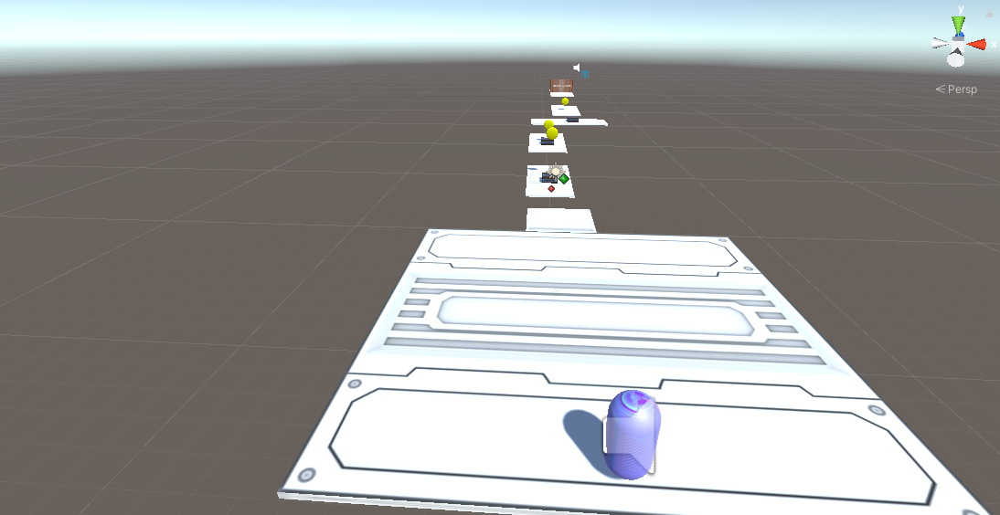

# IT-GMD1Y-S22: Game Development

## Summary
  - [Introduction](#introduction)
  - [The game](#the-game)
  - [Video](#video)
  - [WebGL](#webgl)
  - [Supervisors](#supervisors)
  - [Authors](#authors)

## Introduction
**IT-GMD1-S22** is a course of the [Software Technology Engineering](https://en.via.dk/programmes/bachelor/software-technology-engineering) Bachelor's degree studied in [VIA Universiy College](https://en.via.dk/).
This repository contains the code and documentation of the project carried out throughout the course.

## The Game
The game consists of controlling a character who has to pass all the available levels and at the same time get as many coins as possible. To do this, the character will encounter different fixed and movable platforms and enemies that will try to kill him. Although if you don't want to ignore the enemies you can always jump on them to kill them. Of course, there is no need to worry since the character has unlimited lives.

## Video
You can see a demo of the video game on YouTube here: https://youtu.be/o0rzpCs3n0Y

## WebGL
WebGL (Web Graphics Library) is a JavaScript API for rendering interactive 2D and 3D graphics within any compatible web browser without the use of plug-ins.
So, you are free to try the game in your browser without having to download the code.

If you want you can [PLAY THE VIDEO GAME NOW](https://jordilazo.itch.io/it-gmd1y-ss-jordi-lazo)

## Supervisors
The teachers who have guided this project are:
- [Jakob Knop Rasmussen](https://github.com/KasperKnop)

## Authors
This project have been developed by:
- [Jordi Lazo](https://github.com/JordiLazo)
